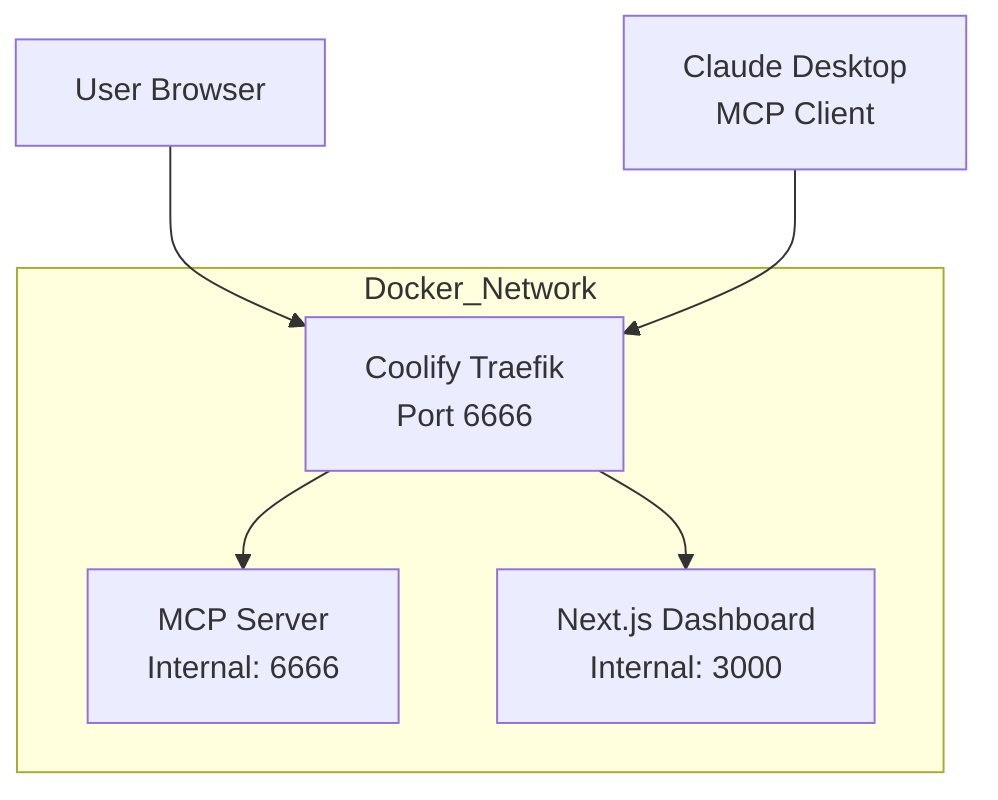

# Obsidian Memory MCP

MCP (Model Context Protocol) server that stores AI memories as Markdown files for visualization in Obsidian's graph view. Includes a Next.js dashboard for visualizing notes. Built with TypeScript and Docker for easy deployment.

<a href="https://glama.ai/mcp/servers/@YuNaga224/obsidian-memory-mcp">
  
</a>

## Table of Contents

- [About](#about)
- [Features](#features)
- [Quick Start](#quick-start)
- [Architecture](#architecture)
- [Dashboard](#dashboard)
- [Storage Format](#storage-format)
- [Configuration](#configuration)
- [API Reference](#api-reference)
- [Deployment](#deployment)
- [Development](#development)
- [Project Structure](#project-structure)
- [Troubleshooting](#troubleshooting)
- [Credits](#credits)
- [License](#license)

## About

This project is a modified version of [Anthropic's memory server](https://github.com/modelcontextprotocol/servers/tree/main/src/memory) that has been adapted for Obsidian integration. The original server stored memories in JSON format, while this version stores them as individual Markdown files with Obsidian-compatible `[[link]]` syntax for graph visualization.

A new **Next.js Dashboard** has been added to visualize and explore your Obsidian notes through a web interface.

### Key Changes from Original

- **Storage Format**: Changed from JSON to individual Markdown files
- **Obsidian Integration**: Added `[[link]]` syntax for relations
- **YAML Frontmatter**: Metadata stored in frontmatter instead of JSON
- **File Structure**: Each entity becomes a separate `.md` file
- **Docker Support**: Added containerization for easy deployment
- **HTTP Transport**: Exposed MCP via HTTP for broader compatibility
- **Dashboard**: Added Next.js web interface at `/dashboard`

## Features

- **Markdown Storage**: Individual `.md` files for each entity
- **Obsidian Integration**: Uses `[[link]]` syntax for graph visualization
- **Knowledge Graph**: Store entities, relations, and observations
- **Search Functionality**: Query across all stored memories
- **YAML Frontmatter**: Metadata stored in frontmatter
- **Docker Support**: Production-ready container with persistent storage
- **HTTP Transport**: REST API endpoint for MCP communication
- **Health Checks**: Built-in monitoring endpoint
- **Dashboard**: Web interface for visualizing notes

## Quick Start

### Option 1: Run with Docker (Recommended)

```bash
# Clone the repository
git clone https://github.com/Ntrakiyski/obsidian-memory-mcp.git
cd obsidian-memory-mcp

# Build and start all services (MCP server + Dashboard)
docker-compose up -d

# Verify MCP server is running
curl http://localhost:6666/health

# Access the dashboard
# Open http://localhost:6666/dashboard in your browser
```

### Option 2: Run Locally (Development)

```bash
# Clone the repository
git clone https://github.com/Ntrakiyski/obsidian-memory-mcp.git
cd obsidian-memory-mcp

# Install MCP server dependencies
npm install

# Build the MCP server
npm run build

# Start the MCP server (runs on port 6666)
npm start

# In a separate terminal, start the dashboard
cd dashboard
npm install
npm run dev

# MCP server: http://localhost:6666
# Dashboard: http://localhost:3000
```

## Architecture



### How It Works

1. **MCP Server** - Handles memory operations via Model Context Protocol
   - Stores entities, relations, and observations as Markdown files
   - Accessible at `/mcp` endpoint
   - Health check at `/health`

2. **Next.js Dashboard** - Web interface for visualization
   - Accessible at `/dashboard` route
   - Reads data from MCP server
   - Will display knowledge graph and statistics

3. **Traefik Reverse Proxy** (Coolify)
   - Routes traffic based on path prefix
   - `/dashboard` -> Next.js
   - `/mcp` -> MCP server
   - Automatically configured via Docker labels

## Dashboard

### Accessing the Dashboard

The dashboard is available at `/dashboard` on the same port as the MCP server:

- **Local**: `http://localhost:6666/dashboard`
- **Production**: `https://your-domain.com/dashboard`

### Dashboard Features

The dashboard provides a web interface to:

- View all entities and their relationships
- Search through stored memories
- Visualize the knowledge graph
- See statistics about your notes
- Navigate through connected entities

### Development

To run the dashboard separately for development:

```bash
cd dashboard

# Install dependencies
npm install

# Start development server with hot reload
npm run dev

# Dashboard runs on http://localhost:3000
# In development, it connects to MCP server at http://localhost:6666
```

### Building for Production

```bash
cd dashboard

# Build the Next.js application
npm run build

# The build output is in .next/ directory
# Ready to be containerized with the provided Dockerfile
```

## Storage Format

Each entity is stored as an individual Markdown file with:

- **YAML frontmatter** for metadata (entityType, created, updated)
- **Obsidian-compatible `[[links]]`** for relations
- **Organized sections** for observations and relations

Example entity file (`John_Doe.md`):

```markdown
---
entityType: person
created: 2025-07-10
updated: 2025-07-10
---

# John Doe

## Observations
- Works at Tech Corp
- Expert in TypeScript
- Lives in Tokyo

## Relations
- [[Manager of::Alice Smith]]
- [[Collaborates with::Bob Johnson]]
- [[Located in::Tokyo Office]]
```

## Configuration

### Environment Variables

| Variable | Default | Description |
|----------|---------|-------------|
| `PORT` | `6666` | HTTP server port for MCP server |
| `MEMORY_DIR` | `/app/data/root_vault` | Directory for storing Markdown files |
| `NODE_ENV` | `production` | Node environment |

### Docker Configuration

The `docker-compose.yml` includes two services:

#### MCP Server (obsidian-memory-mcp)

- Named volume `obsidian-data` bound to `./data` on host
- Health check monitoring
- Auto-restart policy
- Traefik labels for Coolify routing

#### Dashboard (dashboard)

- Next.js application container
- Auto-restart policy
- Traefik labels for Coolify routing

#### Data Persistence

Files are stored in:

- **Host**: `./data/root_vault/` (bind mount)
- **Container**: `/app/data/root_vault/`

This allows:

- Access to files from host machine
- Data persistence across container restarts
- Easy backup and management

## API Reference

### Endpoints

#### GET /health

Health check endpoint for MCP server.

```bash
curl http://localhost:6666/health
```

Response:

```json
{
  "status": "ok",
  "server": "memory-server",
  "storageDir": "/app/data/root_vault"
}
```

#### POST /mcp

MCP protocol endpoint for tool calls.

```bash
curl -X POST http://localhost:6666/mcp \
  -H "Content-Type: application/json" \
  -d '{"jsonrpc": "2.0", "id": 1, "method": "tools/list"}'
```

#### GET /dashboard

Next.js dashboard web interface.

```bash
# Access in browser
http://localhost:6666/dashboard
```

### Available MCP Tools

1. **create_entities** - Create new entities in the knowledge graph
2. **create_relations** - Create relations between entities
3. **add_observations** - Add observations to existing entities
4. **delete_entities** - Delete entities and related data
5. **delete_observations** - Remove specific observations
6. **delete_relations** - Remove relations
7. **read_graph** - Get the entire knowledge graph
8. **search_nodes** - Search entities by query
9. **open_nodes** - Get specific entities by name

## Deployment

### Deploying to Coolify

1. **Push to GitHub**

   ```bash
   # Commit and push your changes
   git add .
   git commit -m "feat: Add dashboard feature"
   git push origin main
   ```

2. **Create Resource in Coolify**

   - Go to your Coolify dashboard
   - Click "Create New Resource"
   - Select your GitHub repository
   - Choose "Docker Compose" as the build pack

3. **Configure Domain**

   - Domain: `http://your-server:6666`
   - Coolify will automatically configure Traefik routing

4. **Deploy**

   Coolify will:
   - Build both MCP server and dashboard containers
   - Configure Traefik routing based on labels
   - Start both services
   - Route `/dashboard` to Next.js and `/mcp` to MCP server

### Manual Docker Deployment

```bash
# Build and start all services
docker-compose up -d

# View logs
docker-compose logs -f

# Check status
docker-compose ps
```

### Local Docker Testing

```bash
# Build all services
docker-compose build

# Start services
docker-compose up -d

# Test endpoints
curl http://localhost:6666/health
# Open http://localhost:6666/dashboard in browser

# Stop services
docker-compose down
```

## Usage with Claude Desktop

### Option 1: Direct Node.js (Local)

Configure in Claude Desktop:

```json
{
  "mcpServers": {
    "obsidian-memory": {
      "command": "node",
      "args": ["/full/path/to/obsidian-memory-mcp/dist/index.js"],
      "env": {
        "MEMORY_DIR": "/path/to/your/obsidian/vault"
      }
    }
  }
}
```

### Option 2: HTTP Transport (Docker or Remote)

```json
{
  "mcpServers": {
    "obsidian-memory-http": {
      "command": "npx",
      "args": ["-y", "@modelcontextprotocol/server-http"],
      "env": {
        "MCP_SERVER_URL": "http://localhost:6666/mcp"
      }
    }
  }
}
```

## Usage with Obsidian

1. Configure Claude Desktop or MCP client with one of the options above
2. Restart Claude Desktop
3. Use the MCP memory tools to create entities and relations
4. Open Obsidian and view the graph

The knowledge graph will be visualized with:

- Entity files as nodes
- `[[links]]` as edges
- Different colors for different entity types (if configured in Obsidian)

## Docker Management

### Start Services

```bash
# Start in detached mode
docker-compose up -d

# Start with logs visible
docker-compose up
```

### Stop Services

```bash
# Stop without removing volumes
docker-compose down

# Stop and remove volumes (deletes all data)
docker-compose down -v
```

### Rebuild After Changes

```bash
docker-compose build
docker-compose up -d
```

### View Logs

```bash
# All logs
docker-compose logs

# Follow logs
docker-compose logs -f

# Specific service
docker-compose logs obsidian-memory-mcp
docker-compose logs dashboard
```

### Check Status

```bash
docker-compose ps
```

### Verify Storage

```bash
# Check container is running
docker-compose ps

# Check health
curl http://localhost:6666/health

# Check volume exists
docker volume ls | grep obsidian

# Check host data directory
ls -la data/
ls -la data/root_vault/
```

## Development

### MCP Server Commands

```bash
# Install dependencies
npm install

# Build TypeScript
npm run build

# Start production server
npm start

# Watch mode (auto-rebuild on changes)
npm run watch

# Type checking
npm run typecheck

# Clean build artifacts
npm run clean
```

### Dashboard Commands

```bash
cd dashboard

# Install dependencies
npm install

# Start development server with hot reload
npm run dev

# Build for production
npm run build

# Start production server
npm start

# Lint code
npm run lint
```

### Project Structure

```
obsidian-memory-mcp/
├── src/                          # MCP server source
│   ├── index.ts                  # Main entry point
│   ├── types.ts                  # TypeScript type definitions
│   ├── storage/
│   │   └── MarkdownStorageManager.ts  # Storage layer
│   └── utils/
│       ├── pathUtils.ts          # Path handling utilities
│       └── markdownUtils.ts      # Markdown parsing/generation
├── dist/                         # Compiled JavaScript (MCP server)
├── dashboard/                    # Next.js dashboard application
│   ├── src/
│   │   └── app/
│   │       ├── page.tsx          # Dashboard home page
│   │       ├── layout.tsx        # Root layout
│   │       └── globals.css       # Global styles
│   ├── public/                   # Static assets
│   ├── Dockerfile               # Dashboard containerization
│   ├── package.json             # Dashboard dependencies
│   ├── next.config.mjs          # Next.js configuration
│   └── tsconfig.json            # TypeScript configuration
├── data/                         # Persistent storage (bind mount)
├── docker-compose.yml            # Docker configuration (both services)
├── Dockerfile                    # MCP server containerization
├── package.json                  # MCP server dependencies
└── tsconfig.json                # TypeScript configuration
```

### Key Files for Dashboard Development

- `dashboard/src/app/page.tsx` - Main dashboard page
- `dashboard/next.config.mjs` - Next.js configuration
- `dashboard/Dockerfile` - Dashboard container build
- `docker-compose.yml` - Service orchestration

## Troubleshooting

### Permission Denied Errors

**Symptom**: `EACCES: permission denied` or `ENOENT: no such file or directory`

**Solution**:

```bash
# Manually create directory with proper permissions
mkdir -p data/root_vault
chmod 755 data/root_vault
docker-compose restart obsidian-memory-mcp
```

### Container Won't Start

**Symptom**: Container exits immediately or shows errors

**Solution**:

```bash
# Check logs for errors
docker-compose logs obsidian-memory-mcp
docker-compose logs dashboard

# Rebuild and restart
docker-compose down -v
docker-compose build
docker-compose up -d
```

### Files Not Persisting

**Symptom**: Files exist during container run but disappear after restart

**Solution**:

```bash
# Verify volume is properly mounted
docker inspect obsidian-memory-mcp | grep -A 20 Mounts

# Look for: "Type": "volume" and "Name": "obsidian-data"
```

### Health Check Fails

**Symptom**: `docker-compose ps` shows unhealthy

**Solution**:

```bash
# Check if port is in use
lsof -i :6666

# Check if server is responding
curl http://localhost:6666/health

# Restart the service
docker-compose restart obsidian-memory-mcp
```

### Dashboard Not Loading

**Symptom**: `/dashboard` returns 404 or error

**Solution**:

```bash
# Check dashboard container logs
docker-compose logs dashboard

# Verify Traefik labels are applied
docker inspect obsidian-dashboard | grep -A 10 Labels

# Check Traefik routing
curl -v http://localhost:6666/dashboard
```

### Build Failures

**Symptom**: Docker build fails

**Solution**:

```bash
# Check build logs
docker-compose build --no-cache

# Verify all required files exist
ls -la dashboard/

# Test build locally
cd dashboard
npm install
npm run build
```

## Contributing

### Adding New Dashboard Features

1. Create a new branch from `main`:

   ```bash
   git checkout -b feature/your-feature
   ```

2. Make changes in `dashboard/src/app/`
3. Test locally with `npm run dev`
4. Build and test production mode with `npm run build`
5. Commit and push:

   ```bash
   git add dashboard/
   git commit -m "feat: Add your feature"
   git push origin feature/your-feature
   ```

6. Create a pull request on GitHub

### Adding New MCP Tools

1. Add tool definition in `src/index.ts`
2. Implement tool logic in appropriate module
3. Update API Reference in this README
4. Test with `curl` commands

## Roadmap

Future enhancements for the dashboard:

- [ ] Knowledge graph visualization
- [ ] Entity relationship browser
- [ ] Search functionality
- [ ] Statistics dashboard
- [ ] Bulk operations
- [ ] Import/Export tools
- [ ] Dark mode theme

## Credits

This project is based on [Anthropic's memory server](https://github.com/modelcontextprotocol/servers/tree/main/src/memory) from the Model Context Protocol servers collection. We thank Anthropic for releasing the original implementation under the MIT license.

## License

MIT License - see [LICENSE](LICENSE) file for details.

Original memory server: Copyright (c) 2024 Anthropic, PBC
Obsidian integration modifications: Copyright (c) 2025 Ntrakiyski

## Support

For issues and feature requests, please open a GitHub issue.
